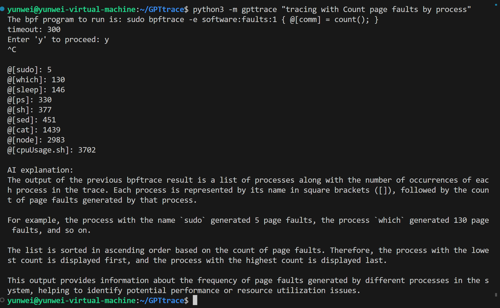
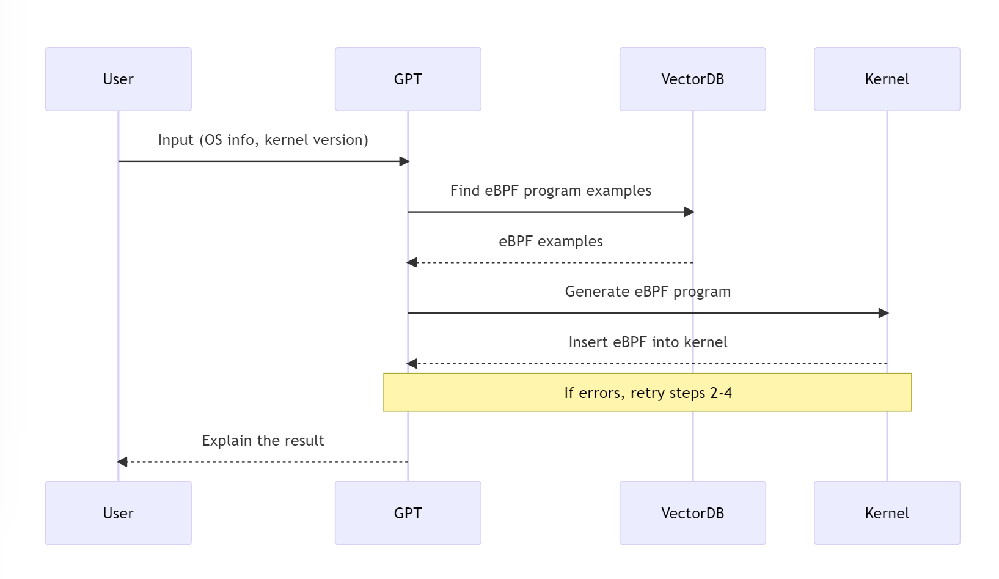

# GPTtrace 🤖

[](https://opensource.org/licenses/MIT)
[](https://github.com/eunomia-bpf/GPTtrace/actions)
[](https://deepsource.io/gh/eunomia-bpf/eunomia-bpf/?ref=repository-badge)
[](https://www.codefactor.io/repository/github/eunomia-bpf/eunomia-bpf)
[](https://zenodo.org/badge/latestdoi/603351016)

An experiment for generating eBPF programs and tracing with GPT and natural language

Want the online version? please see [GPTtrace-web](https://github.com/eunomia-bpf/GPTtrace-web) for **online demo**!

### **Checkout our paper [Kgent: Kernel Extensions Large Language Model Agent](https://dl.acm.org/doi/10.1145/3672197.3673434) in eBPF'24!**

## Key Features 💡

### Interact and Tracing your Linux with natural language

example: tracing with Count page faults by process



- start tracing with natural language
- let AI explain the result to you

### Generate eBPF programs with natural language

example: Write an eBPF program Print entered bash commands from all running shells, save the bpf program to a file and exit without actual run it.


We use examples from [bpftrace tools](tools) to create vector store and search.

For more detail documents and tutorials about how to write eBPF programs, please refer to:  [`bpf-developer-tutorial`](https://github.com/eunomia-bpf/bpf-developer-tutorial) (a libbpf tool tutorial to teach ChatGPT to write eBPF programs)

### Choose the right bcc command line tool to complete the tracking task

Use the right bcc tools to trace the kernel

```console
$ python3 gpttrace "Trace allocations and display each individual allocator function call"
 Run:  sudo memleak-bpfcc --trace 
Attaching to kernel allocators, Ctrl+C to quit.
(b'Relay(35)', 402, 6, b'd...1', 20299.252425, b'alloc exited, size = 4096, result = ffff8881009cc000')
(b'Relay(35)', 402, 6, b'd...1', 20299.252425, b'free entered, address = ffff8881009cc000, size = 4096')
(b'Relay(35)', 402, 6, b'd...1', 20299.252426, b'free entered, address = 588a6f, size = 4096')
(b'Relay(35)', 402, 6, b'd...1', 20299.252427, b'alloc entered, size = 4096')
(b'Relay(35)', 402, 6, b'd...1', 20299.252427, b'alloc exited, size = 4096, result = ffff8881009cc000')
(b'Relay(35)', 402, 6, b'd...1', 20299.252428, b'free entered, address = ffff8881009cc000, size = 4096')
(b'sudo', 6938, 10, b'd...1', 20299.252437, b'alloc entered, size = 2048')
(b'sudo', 6938, 10, b'd...1', 20299.252439, b'alloc exited, size = 2048, result = ffff88822e845800')
(b'node', 410, 18, b'd...1', 20299.252455, b'alloc entered, size = 256')
(b'node', 410, 18, b'd...1', 20299.252457, b'alloc exited, size = 256, result = ffff8882e9b66400')
(b'node', 410, 18, b'd...1', 20299.252458, b'alloc entered, size = 2048')
```

## How it works



1. **User Input**: The user provides their operating system information and kernel version. This information is crucial as it helps to tailor the eBPF program to the specific environment of the user.
2. **Prompt Construction**: The user's input, along with the OS info and kernel version, is used to construct a prompt. This prompt is designed to guide the generation of the eBPF program.
3. **Vector Database Query**: The constructed prompt is used to query the Vector Database for eBPF program examples. These examples serve as a basis for generating the eBPF program that will be inserted into the kernel.
4. **Hook Point Identification**: The GPT API is used to identify potential hook points in the eBPF program. These hook points are locations in the code where the eBPF program can be inseted to monitor or modify the behavior of the kernel.
5. **eBPF Program Generation**: The identified hook points, along with the examples from the Vector Database, are used to generate the eBPF program. This program is designed to be inserted into the kernel to perform the desired tracing tasks.
6. **Kernel Insertion**: The generated eBPF program is inserted into the kernel. If there are any errors during this process, the tool will retry the steps from querying the Vector Database to kernel insertion a few times.
7. **Result Explanation**: Once the eBPF program is successfully inserted into the kernel, the AI will explain the result to the user. This includes an explanation of what the eBPF program is doing and how it is interacting with the kernel.

This process ensures that the eBPF program is tailored to the user's specific environment and needs, and that the user understands how the program works and what it is doing.

## Installation 🔧

```sh
pip install gpttrace
```

## Usage and Setup 🛠

```console
$ python3 -m gpttrace -h
usage: GPTtrace [-h] [-c CMD_NAME QUERY] [-v] [-k OPENAI_API_KEY]
                input_string

Use ChatGPT to write eBPF programs (bpftrace, etc.)

positional arguments:
  input_string          Your question or request for a bpf program

options:
  -h, --help            show this help message and exit
  -c CMD_NAME QUERY, --cmd CMD_NAME QUERY
                        Use the bcc tool to complete the trace task
  -v, --verbose         Show more details
  -k OPENAI_API_KEY, --key OPENAI_API_KEY
                        Openai api key, see
                        `https://platform.openai.com/docs/quickstart/add-
                        your-api-key` or passed through `OPENAI_API_KEY`
```

### First: login to ChatGPT

- Access https://platform.openai.com/docs/quickstart/add-your-api-key，then create your openai api key as following:

  

- Remember your key, and then set it to the environment variable `OPENAI_API_KEY` or use the `-k` option.

### start your tracing! 🚀

For example:

```sh
python3 gpttrace "Count page faults by process"
```

If the eBPF program cannot be loaded into the kernel, The error message will be used to correct ChatGPT, and the result will be printed to the console.

## Examples

- Files opened by process
- Syscall count by program
- Read bytes by process:
- Read size distribution by process:
- Show per-second syscall rates:
- Trace disk size by process
- Count page faults by process
- Count LLC cache misses by process name and PID (uses PMCs):
- Profile user-level stacks at 99 Hertz, for PID 189:
- Files opened, for processes in the root cgroup-v2

## LICENSE

MIT

## 🔗 Links

- detail documents and tutorials about how we train ChatGPT to write eBPF programs: https://github.com/eunomia-bpf/bpf-developer-tutorial （基于 CO-RE (一次编写，到处运行） libbpf 的 eBPF 开发者教程：通过 20 个小工具一步步学习 eBPF（尝试教会 ChatGPT 编写 eBPF 程序）
- bpftrace: https://github.com/iovisor/bpftrace
- ChatGPT: https://chat.openai.com/
