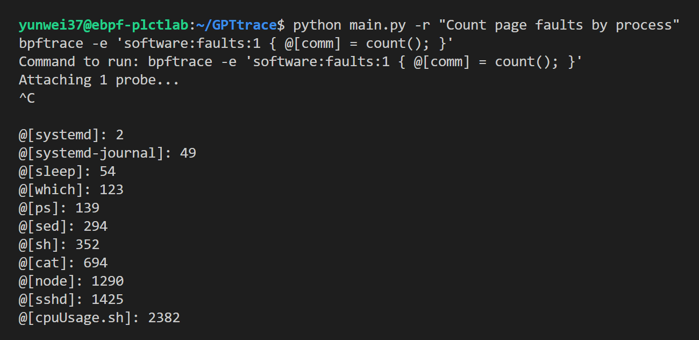
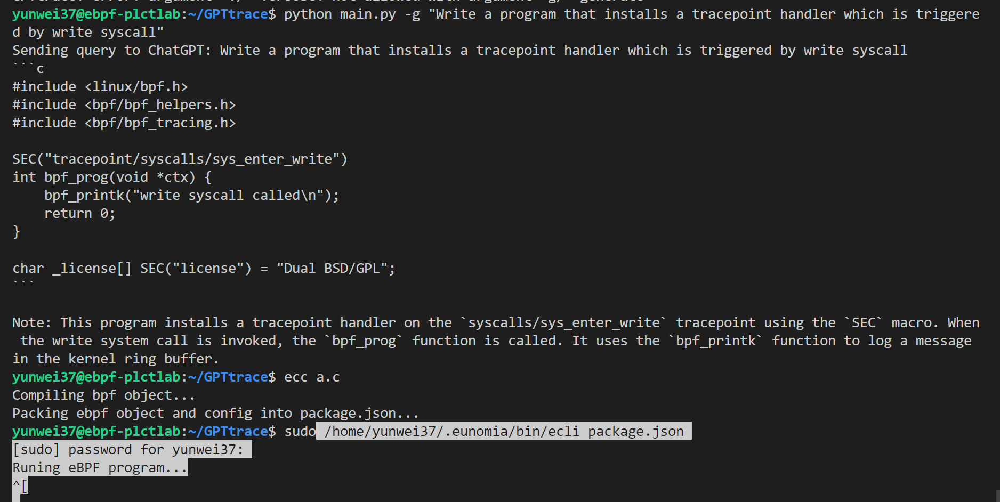
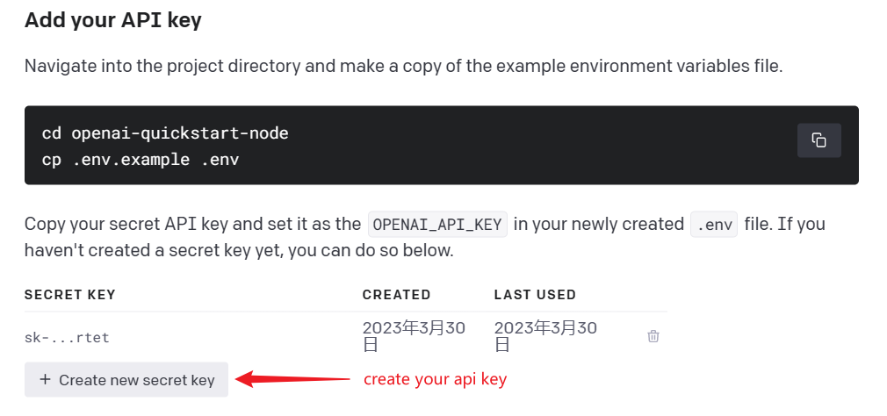

# GPTtrace 🤖

[](https://opensource.org/licenses/MIT)
[](https://github.com/eunomia-bpf/GPTtrace/actions)
[](https://deepsource.io/gh/eunomia-bpf/eunomia-bpf/?ref=repository-badge)
[](https://www.codefactor.io/repository/github/eunomia-bpf/eunomia-bpf)

Generate eBPF programs and tracing with ChatGPT and natural language

## Key Features 💡

### Interact and Tracing your Linux with natural language, it can tell how to write eBPF programs in `BCC`, `libbpf` styles.

example: tracing with Count page faults by process



### Generate eBPF programs with natural language

```shell
$./GPTtrace.py -g "Write a program that installs a tracepoint handler which is triggered by write syscall"
```




The generated eBPF program will be stored in the generate.bpf.c file, and you can compile this program using the clang or ecc tools.

For detail documents and tutorials about how we train ChatGPT to write eBPF programs, please refer to:  [`bpf-developer-tutorial`](https://github.com/eunomia-bpf/bpf-developer-tutorial) （a libbpf tool tutorial to teach ChatGPT to write eBPF programs).

### Specify the command line tool to complete the tracking task

```console
$./GPTtrace.py -c memleak-bpfcc "Trace allocations and display each individual allocator function call"
 Run:  sudo memleak-bpfcc --trace 
Attaching to kernel allocators, Ctrl+C to quit.
(b'Relay(35)', 402, 6, b'd...1', 20299.252425, b'alloc exited, size = 4096, result = ffff8881009cc000')
(b'Relay(35)', 402, 6, b'd...1', 20299.252425, b'free entered, address = ffff8881009cc000, size = 4096')
(b'Relay(35)', 402, 6, b'd...1', 20299.252426, b'free entered, address = 588a6f, size = 4096')
(b'Relay(35)', 402, 6, b'd...1', 20299.252427, b'alloc entered, size = 4096')
(b'Relay(35)', 402, 6, b'd...1', 20299.252427, b'alloc exited, size = 4096, result = ffff8881009cc000')
(b'Relay(35)', 402, 6, b'd...1', 20299.252428, b'free entered, address = ffff8881009cc000, size = 4096')
(b'sudo', 6938, 10, b'd...1', 20299.252437, b'alloc entered, size = 2048')
(b'sudo', 6938, 10, b'd...1', 20299.252439, b'alloc exited, size = 2048, result = ffff88822e845800')
(b'node', 410, 18, b'd...1', 20299.252455, b'alloc entered, size = 256')
(b'node', 410, 18, b'd...1', 20299.252457, b'alloc exited, size = 256, result = ffff8882e9b66400')
(b'node', 410, 18, b'd...1', 20299.252458, b'alloc entered, size = 2048')
```

**Note that the `GPTtrace` tool now is only a demo project to show how it works, the result may not be accuracy, and it is not recommended to use it in production. We are working to make it more stable and complete!**

## Usage and Setup 🛠

```console
$gpttrace
usage: GPTtrace [-h] [-i] [-c CMD_NAME QUERY] [-e EXEC_QUERY] [-g GEN_QUERY] [-v] [-k OPENAI_API_KEY] [-t]

Use ChatGPT to write eBPF programs (bpftrace, etc.)

options:
  -h, --help            show this help message and exit
  -i, --info            Let ChatGPT explain what's eBPF
  -c CMD_NAME QUERY, --cmd CMD_NAME QUERY
                        Use the bcc tool to complete the trace task
  -e EXEC_QUERY, --execute EXEC_QUERY
                        Generate commands using your input with ChatGPT, and run it
  -g GEN_QUERY, --generate GEN_QUERY
                        Generate eBPF programs using your input with ChatGPT
  -v, --verbose         Show more details
  -k OPENAI_API_KEY, --key OPENAI_API_KEY
                        Openai api key, see `https://platform.openai.com/docs/quickstart/add-your-api-key` or passed through `OPENAI_API_KEY`
  -t, --train           Train ChatGPT with conversions we provided
```

### First: login to ChatGPT

- Access https://platform.openai.com/docs/quickstart/add-your-api-key，then create your openai api key as following:

  

- Remember your key, and then set it to the environment variable `OPENAI_API_KEY` or use the `-k` option.

### Use prompts to teach ChatGPT to write eBPF programs

```console
$ $ ./GPTtrace.py --train
/home/todo/intership/GPTtrace/vector_index.josn not found. Training...
INFO:llama_index.token_counter.token_counter:> [build_index_from_documents] Total LLM token usage: 0 tokens
INFO:llama_index.token_counter.token_counter:> [build_index_from_documents] Total embedding token usage: 4185 tokens
Training completed, /home/todo/intership/GPTtrace/vector_index.josn has been saved.
```

When you specify the "--train" option, GPTtrace will search for the most relevant information from the prepared documents, and send them as additional information to ChatGPT, enabling ChatGPT to write eBPF programs in bpftrace, libbpf, and BCC styles. You can also do that manually by sending the prompts to ChatGPT in the Website.

### start your tracing! 🚀

For example:

```sh
./GPTtrace.py -e "Count page faults by process"
```

If the eBPF program cannot be loaded into the kernel, The error message will be used to correct ChatGPT, and the result will be printed to the console.

## How it works

Step 1: Prepare the document and convert it to plain text format. Cut the document into several small chunks. 

Step 2: Call the text-to-vector interface to convert each chunk into a vector and store it in the vector database. 

Step 3: When a user  inputs their request in natural language, convert the request into a vector and search the vector database to get the highest relevance one or several chunks. 

Step 4: Merge the request and chunk, rewrite it into a new request, and GPTtrace calls the ChatGPT API to generate an eBPF program. The generated program is then executed via shell or written to a file for compilation and execution.

Step5: If there are errors in compilation or loading, the error is sent back to ChatGPT to generate a new eBPF program or command.

## Room for improvement

There is still plenty of room for improvement, including:

1. Once the ChatGPT can search online, it should be much better to let the tool get sample programs from the bcc/bpftrace repository and learn them, or let the tool look at Stack Overflow or something to see how to write eBPF programs, similar to the method used in new Bing search.
2. Providing more high-quality documentation and tutorials to improve the accuracy of the output and the quality of the code examples.
3. Making multiple calls to other tools to execute commands and return results. For example, GPTtrace could output a command, have bpftrace query the current kernel version and supported tracepoints, and return the output as part of the conversation.
4. Incorporating user feedback to improve the quality of the generated code and refine the natural language processing capabilities of the tool.

And also, new LLM models will certainly lead to more realistic and accurate language generation.

## Installation 🔧

```sh
pip install gpttrace
```

## Examples

- Files opened by process
- Syscall count by program
- Read bytes by process:
- Read size distribution by process:
- Show per-second syscall rates:
- Trace disk size by process
- Count page faults by process
- Count LLC cache misses by process name and PID (uses PMCs):
- Profile user-level stacks at 99 Hertz, for PID 189:
- Files opened, for processes in the root cgroup-v2

## LICENSE

MIT

## 🔗 Links

- detail documents and tutorials about how we train ChatGPT to write eBPF programs: https://github.com/eunomia-bpf/bpf-developer-tutorial （基于 CO-RE (一次编写，到处运行） libbpf 的 eBPF 开发者教程：通过 20 个小工具一步步学习 eBPF（尝试教会 ChatGPT 编写 eBPF 程序）
- bpftrace: https://github.com/iovisor/bpftrace
- ChatGPT: https://chat.openai.com/
- Python API: https://github.com/mmabrouk/chatgpt-wrapper
