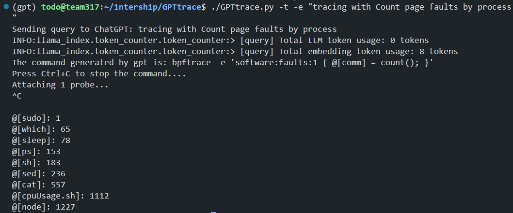

# GPTtrace

Generate eBPF programs and tracing with ChatGPT and natural language

## Introduction

- Tracing with natural language



- Generate eBPF programs with natural language


## Usage

```console
$ python main.py
usage: GPTtrace [-h] [-e | -v | -r TEXT] [-u UUID] [-t ACCESS_TOKEN]

Use ChatGPT to write eBPF programs (bpftrace, etc.)

optional arguments:
  -h, --help            show this help message and exit
  -e, --explain         Let ChatGPT explain what's eBPF
  -v, --verbose         Print the receive
  -r TEXT, --run TEXT   Generate commands using your input with ChatGPT, and run it
  -u UUID, --uuid UUID  Conversion UUID to use, or passed through environment variable `GPTTRACE_CONV_UUID`
  -t ACCESS_TOKEN, --access-token ACCESS_TOKEN
                        ChatGPT access token, see `https://chat.openai.com/api/auth/session` or passed through
                        `GPTTRACE_ACCESS_TOKEN`
```

## Examples

- Files opened by process
- Syscall count by program
- Read bytes by process:
- Read size distribution by process:
- Show per-second syscall rates:
- Trace disk size by process
- Count page faults by process
- Count LLC cache misses by process name and PID (uses PMCs):
- Profile user-level stacks at 99 Hertz, for PID 189:
- Files opened, for processes in the root cgroup-v2

## 🔗 Links

- detail documents and tutorials about how we train ChatGPT to write eBPF programs: https://github.com/eunomia-bpf/bpf-developer-tutorial （基于 CO-RE (一次编写，到处运行） libbpf 的 eBPF 开发者教程：通过 20 个小工具一步步学习 eBPF（尝试教会 ChatGPT 编写 eBPF 程序）
- bpftrace: https://github.com/iovisor/bpftrace
- ChatGPT: https://chat.openai.com/
